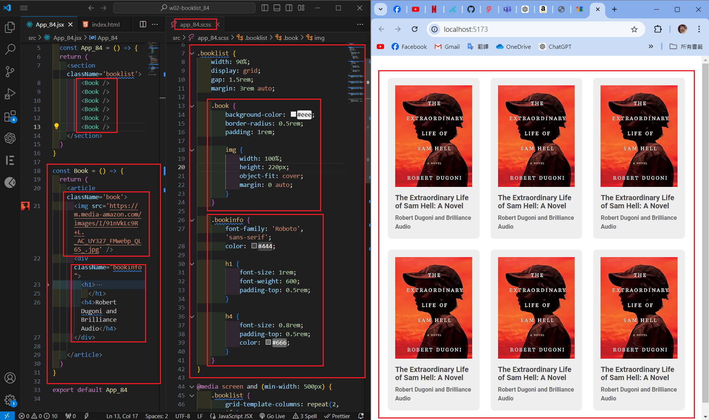
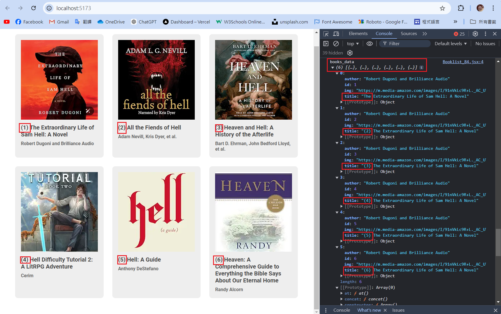
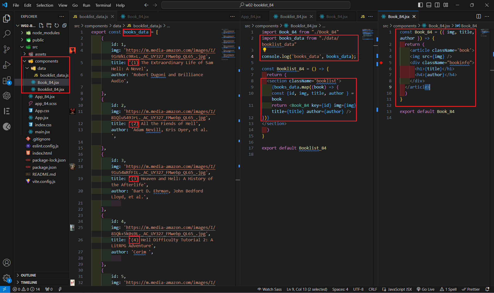

[Githun URL](https://github.com/kupowen/1131-wp1-demo-84)

### W02-P1: Github share to teacher (htchung@gms.tku.edu.tw) and TA (sian-0018)


```
4e9d5ef 212410384       Sun Sep 22 20:41:06 2024 +0800  W02-P1: Github share to teacher (htchung@gms.tku.edu.tw) and TA (sian-0018)
```

### W02-P2: Show 6 <Book /> in React with responsive design



```
ae93125 212410384       Sun Sep 22 20:45:10 2024 +0800  W02-P2: Show 6 <Book /> in React with responsive design
```

### W02-P3: Create books_data (6 similar data) as json array and put it into <Booklist_84 />, then create 6 <Book_84 />




```

```

### W02-P4: Create books_data (6 similar data) as json array and put it into <Booklist_84 />, then create 6 <Book_84 />


```

```

### W02-P5: all git logs of w2


```
git log --pretty=format:"%h%x09%an%x09%ad%x09%s" --after="2024-9-21"
```