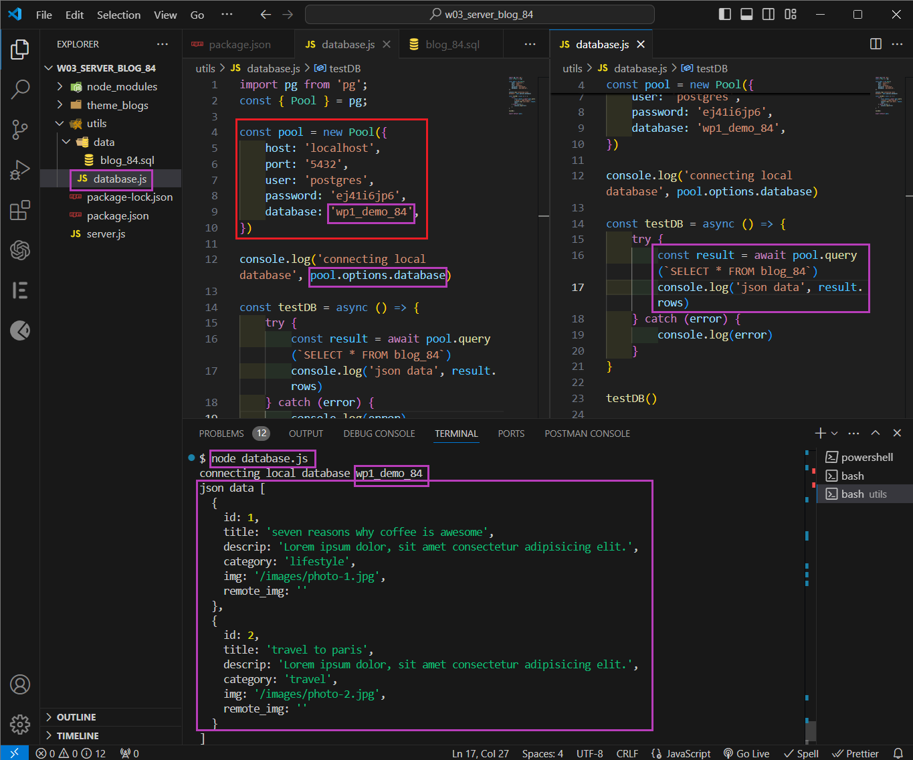
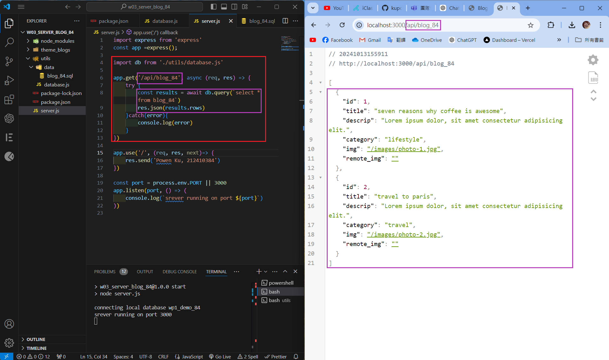
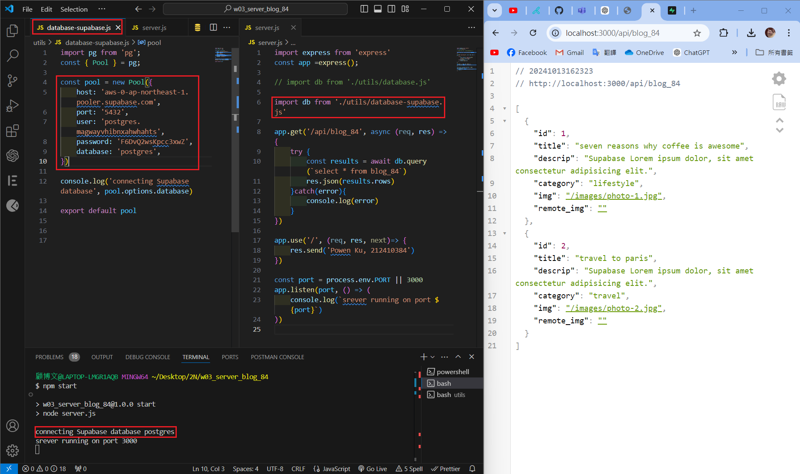
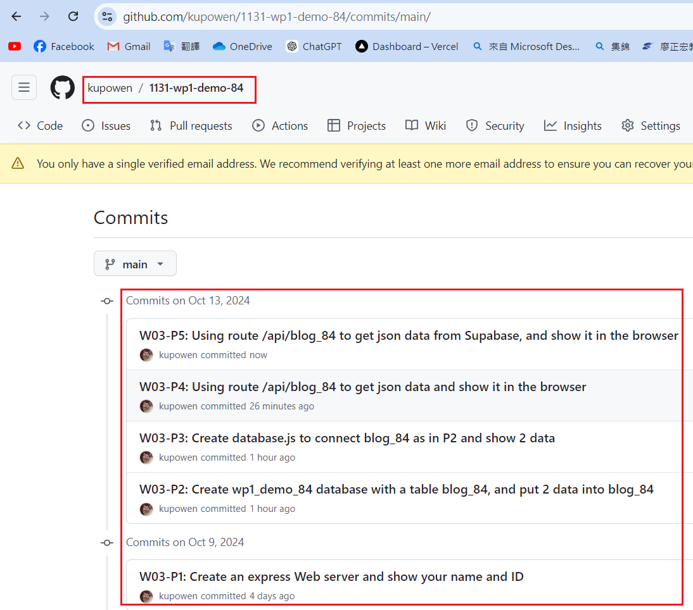

[Githun URL](https://github.com/kupowen/1131-wp1-demo-84)

### W03-P1: Create an express Web server and show your name and ID


```
116bd00 212410384       Wed Oct 9 11:05:45 2024 +0800   W03-P1: Create an express Web server and show your name and ID
```

### W03-P2: Create wp1_demo_84 database with a table blog_84, and put 2 data into blog_84


```
0ba0f07 212410384       Sun Oct 13 14:47:43 2024 +0800  W03-P2: Create wp1_demo_84 database with a table blog_84, and put 2 data into blog_84
```

### W03-P3: Create database.js to connect blog_84 as in P2 and show 2 data



```
cb9295c 212410384       Sun Oct 13 15:29:34 2024 +0800  W03-P3: Create database.js to connect blog_84 as in P2 and show 2 data
```

### W03-P4: Using route /api/blog_84 to get json data and show it in the browser



```
9d641e3 212410384       Sun Oct 13 16:04:46 2024 +0800  W03-P4: Using route /api/blog_84 to get json data and show it in the browser
```

### W03-P5: Using route /api/blog_84 to get json data from Supabase, and show it in the browser



```
8287a34 212410384       Sun Oct 13 16:30:16 2024 +0800  W03-P5: Using route /api/blog_84 to get json data from Supabase, and show it in the browser
```

### W03-P6: all git logs of w3



```
git log --pretty=format:"%h%x09%an%x09%ad%x09%s" --after="2024-9-24"
8287a34 212410384       Sun Oct 13 16:30:16 2024 +0800  W03-P5: Using route /api/blog_84 to get json data from Supabase, and show it in the browser
9d641e3 212410384       Sun Oct 13 16:04:46 2024 +0800  W03-P4: Using route /api/blog_84 to get json data and show it in the browser
cb9295c 212410384       Sun Oct 13 15:29:34 2024 +0800  W03-P3: Create database.js to connect blog_84 as in P2 and show 2 data
0ba0f07 212410384       Sun Oct 13 14:47:43 2024 +0800  W03-P2: Create wp1_demo_84 database with a table blog_84, and put 2 data into blog_84
116bd00 212410384       Wed Oct 9 11:05:45 2024 +0800   W03-P1: Create an express Web server and show your name and ID
```