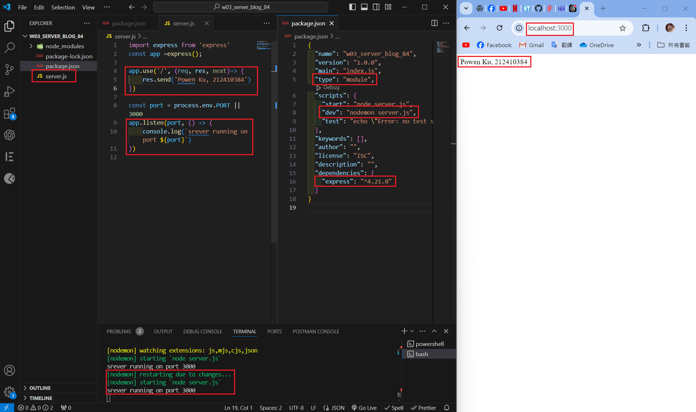
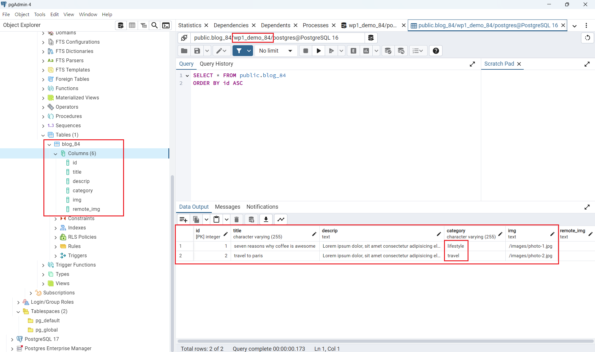
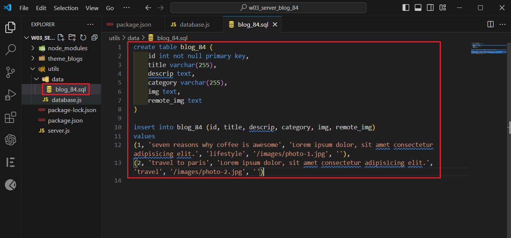

[Githun URL](https://github.com/kupowen/1131-wp1-demo-84)

### W03-P1: Create an express Web server and show your name and ID



```
116bd00 212410384       Wed Oct 9 11:05:45 2024 +0800   W03-P1: Create an express Web server and show your name and ID
```

### W03-P2: Create wp1_demo_84 database with a table blog_84, and put 2 data into blog_84




```

```

### W03-P3: 


```

```

### W03-P4: 


```

```

### W03-P5: all git logs of w3


```
git log --pretty=format:"%h%x09%an%x09%ad%x09%s" --after="2024-9-24"
```