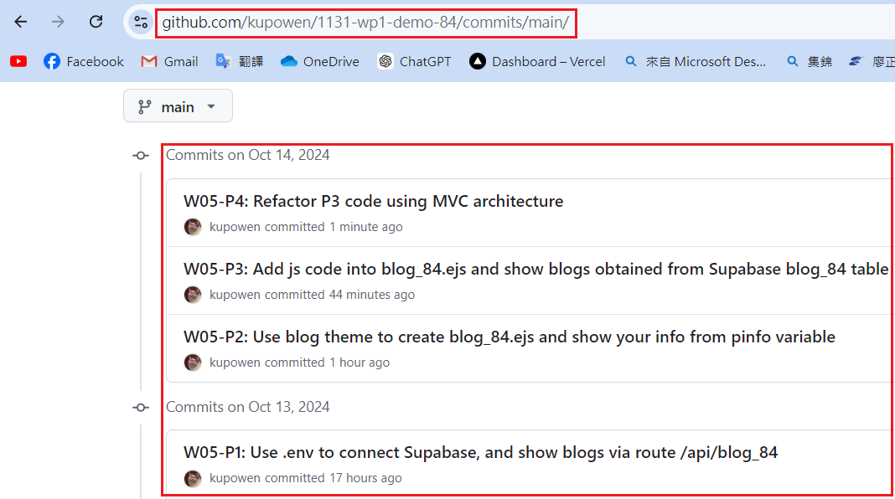

[Githun URL](https://github.com/kupowen/1131-wp1-demo-84)

### W05-P1: Use .env to connect Supabase, and show blogs via route /api/blog_84


```
d1bea11 212410384       Sun Oct 13 22:53:41 2024 +0800  W05-P1: Use .env to connect Supabase, and show blogs via route /api/blog_84
```

### W05-P2: Use blog theme to create  blog_84.ejs and show your info from pinfo variable


```
59ef2bf 212410384       Mon Oct 14 15:08:08 2024 +0800  W05-P2: Use blog theme to create  blog_84.ejs and show your info from pinfo variable
```

### W05-P3: Add js code into blog_84.ejs and show blogs obtained from Supabase blog_84 table


```
befcda3 212410384       Mon Oct 14 15:46:16 2024 +0800  W05-P3: Add js code into blog_84.ejs and show blogs obtained from Supabase blog_84 table
```

### W05-P4: Refactor P3 code using MVC architecture


```

```

### W05-P5: all git logs of w5



```
git log --pretty=format:"%h%x09%an%x09%ad%x09%s" --after="2024-10-8"

```