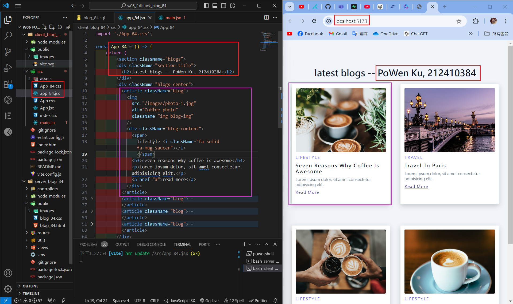
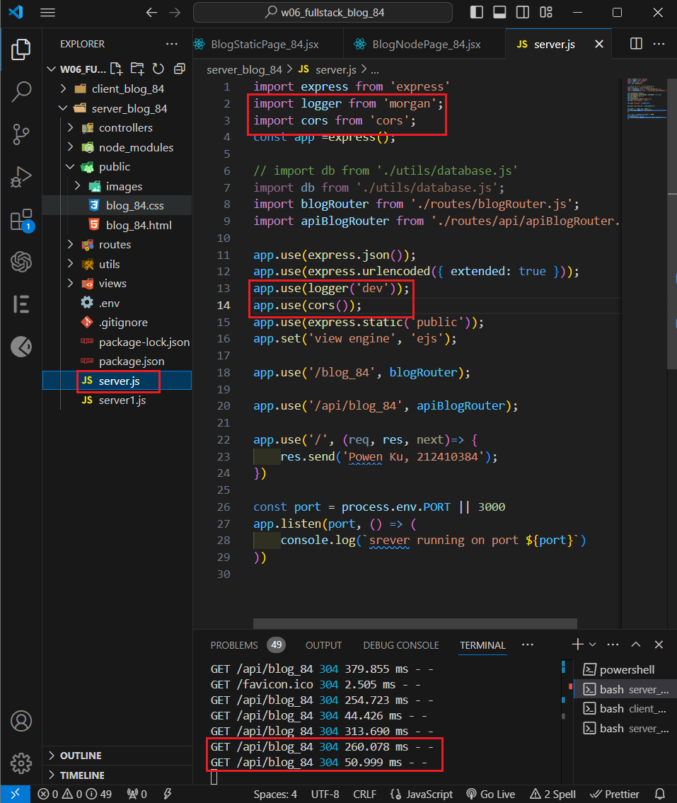

[Githun URL](https://github.com/kupowen/1131-wp1-demo-84)

### W06-P1: Insert 9 blogs into Supabase, and retrieve through route localhost:3000/api/blog_84


```
7b54c6f 212410384       Sat Oct 19 08:43:50 2024 +0800  W06-P1: Insert 9 blogs into Supabase, and retrieve through route localhost:3000/api/blog_84
```

### W06-P2: Create a vite, and show 4 blogs from blog.html



```
4b7a4f7 212410384       Sat Oct 19 13:31:40 2024 +0800  W06-P2: Create a vite, and show 4 blogs from blog.html
```

### W06-P3: Create BlogStaticPage_84 component to show 4 static photos with corresponding react-icons


```
8be726e 212410384       Sat Oct 19 14:46:57 2024 +0800  W06-P3: Create BlogStaticPage_84 component to show 4 static photos with corresponding react-icons
```

### W06-P4: Get the blogs from node server

#### => use console to check if blogs are retrieved from the node server


#### => use React DevTools to view blogs


#### => server setup cors and morgan


```

```

### W06-P5: all git logs of w6


```
git log --pretty=format:"%h%x09%an%x09%ad%x09%s" --after="2024-10-15"


```