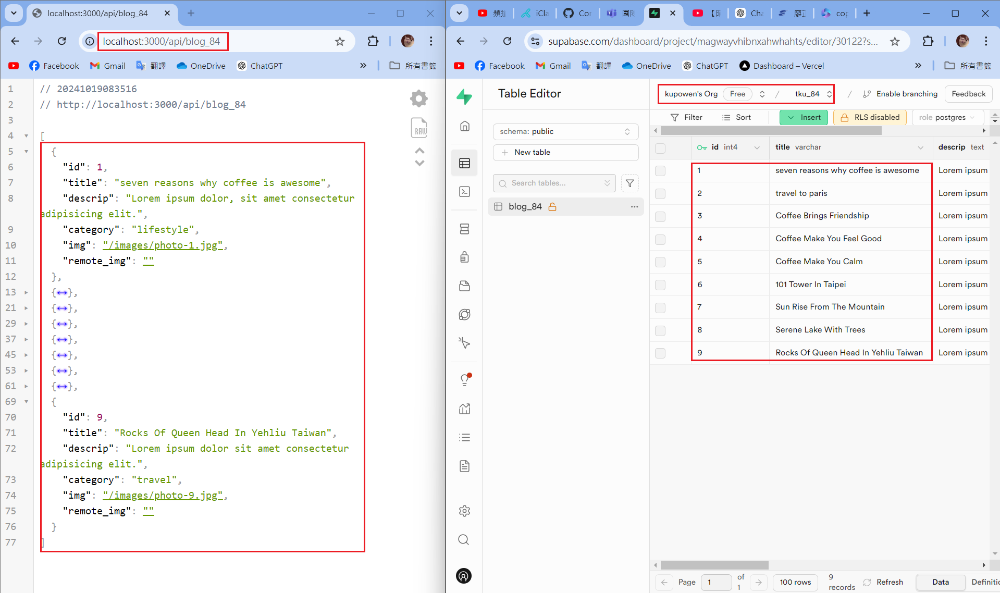
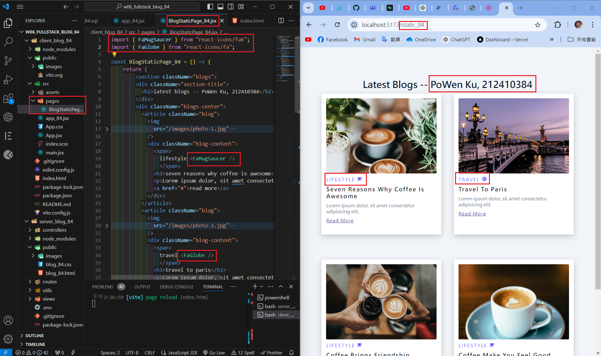
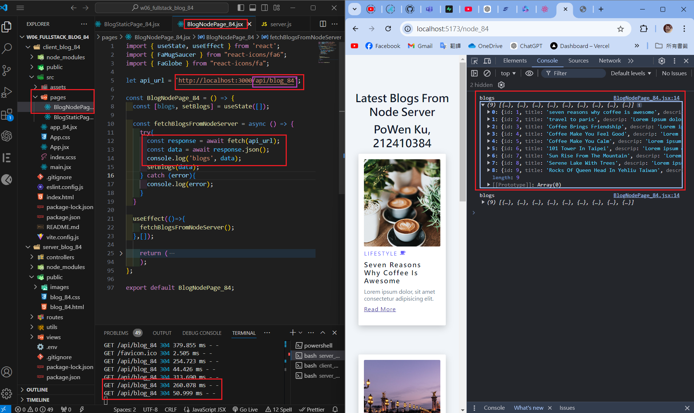
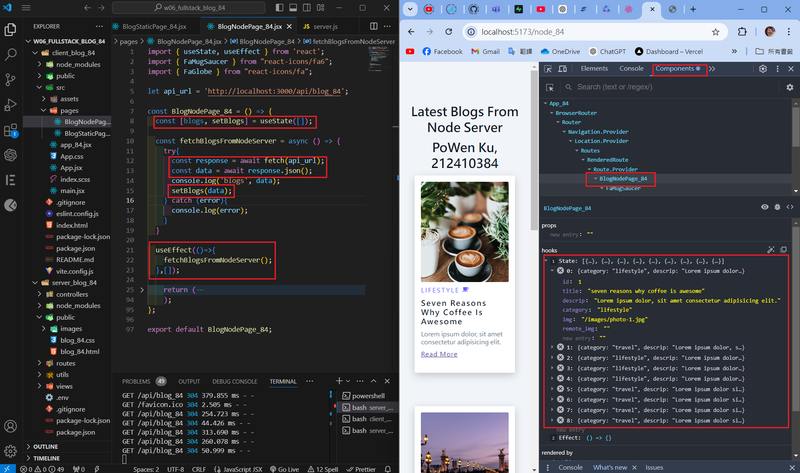
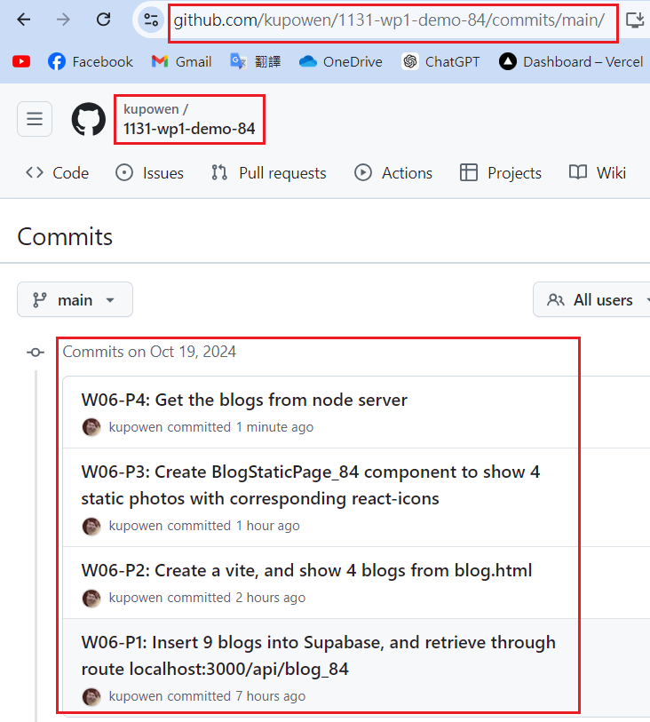

[Githun URL](https://github.com/kupowen/1131-wp1-demo-84)

### W06-P1: Insert 9 blogs into Supabase, and retrieve through route localhost:3000/api/blog_84



```

```

### W06-P2: 


```

```

### W06-P3: 



```

```

### W06-P4: 





```

```

### W06-P5: all git logs of w6



```
git log --pretty=format:"%h%x09%an%x09%ad%x09%s" --after="2024-10-15"


```