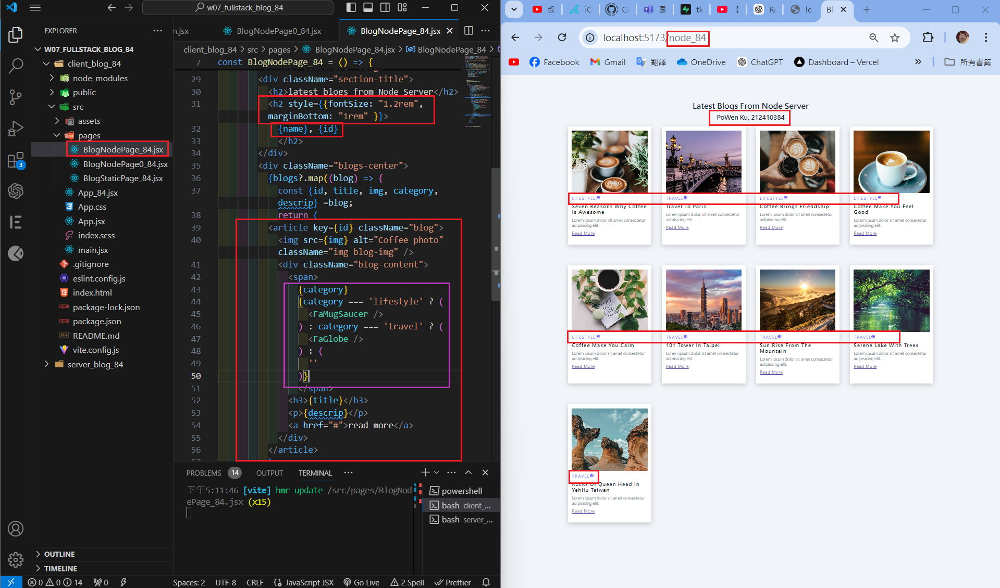
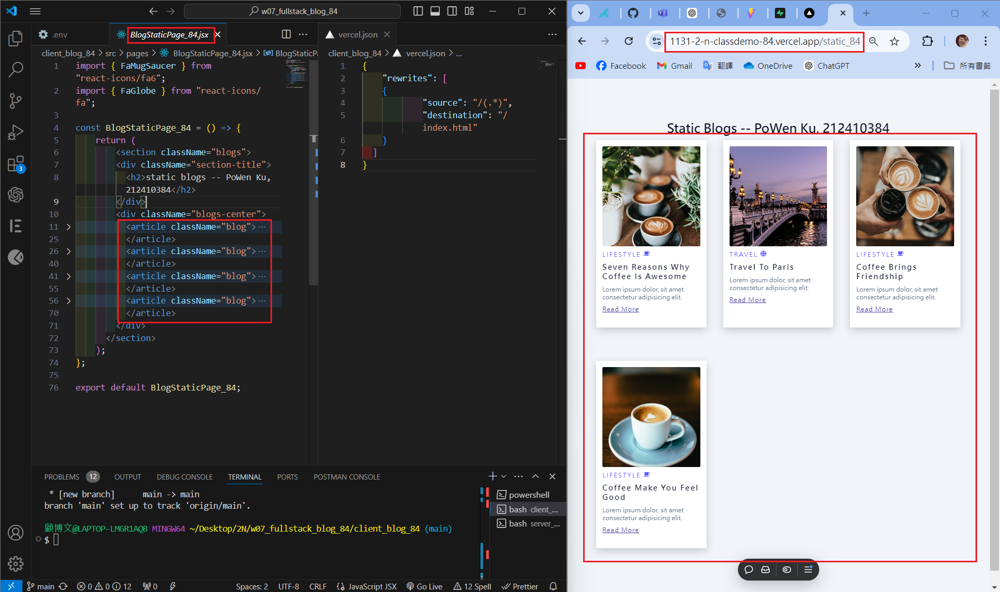
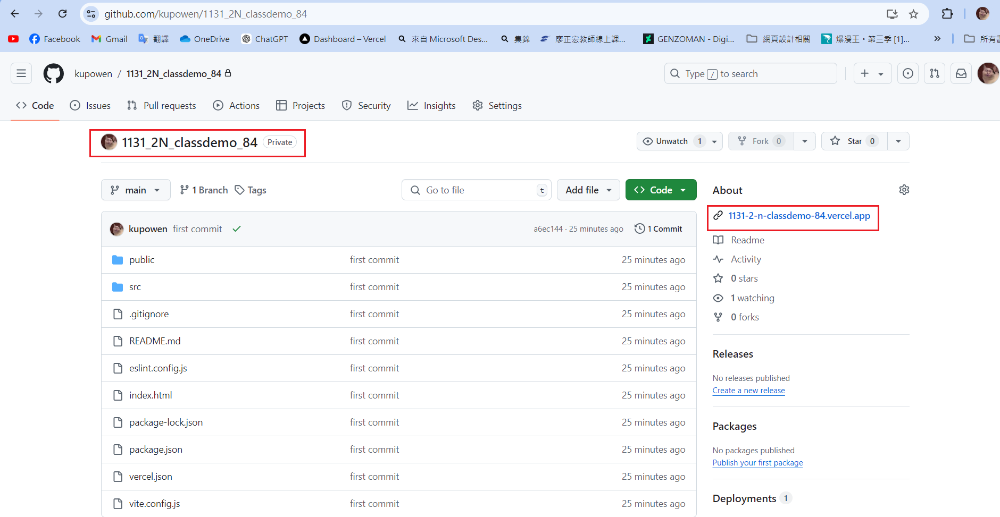
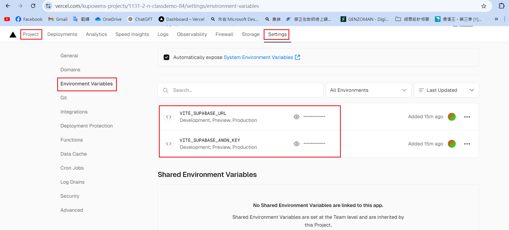
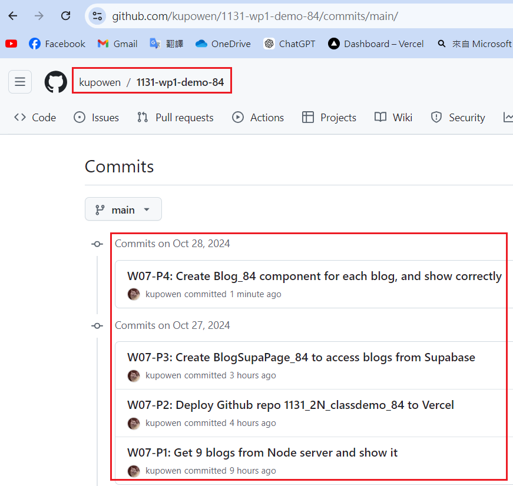

[Githun URL](https://github.com/kupowen/1131-wp1-demo-84)

### W07-P1: Get 9 blogs from Node server and show it



```
e922ae8 212410384       Sun Oct 27 17:18:49 2024 +0800  W07-P1: Get 9 blogs from Node server and show it
```

### W07-P2: Deploy Github repo 1131_2N_classdemo_84 to Vercel

#### => Chrome using /static_84 route



#### => Github repo with associated Vercel link



#### => Vercel Projuect with settings (environment variable)



```

```

### W07-P3: 


```

```

### W07-P4: 


```

```

### W07-P5: all git logs of w7



```
git log --pretty=format:"%h%x09%an%x09%ad%x09%s" --after="2024-10-22"

```