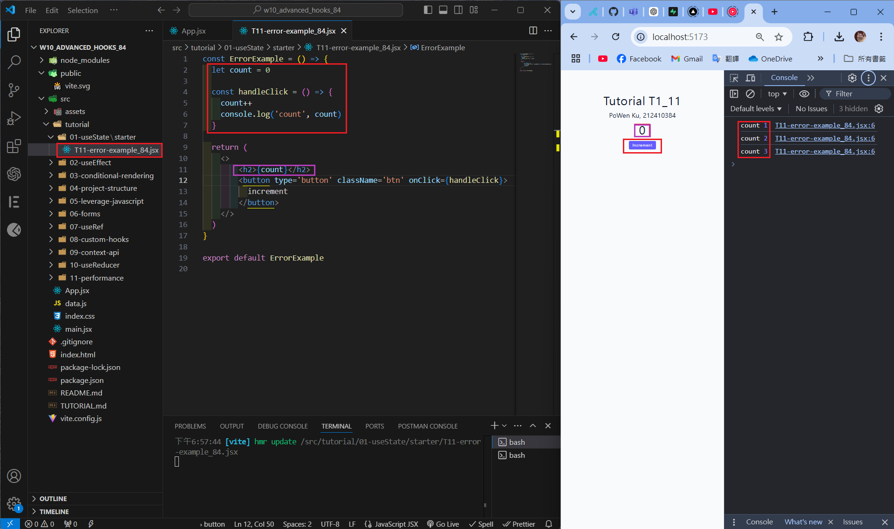
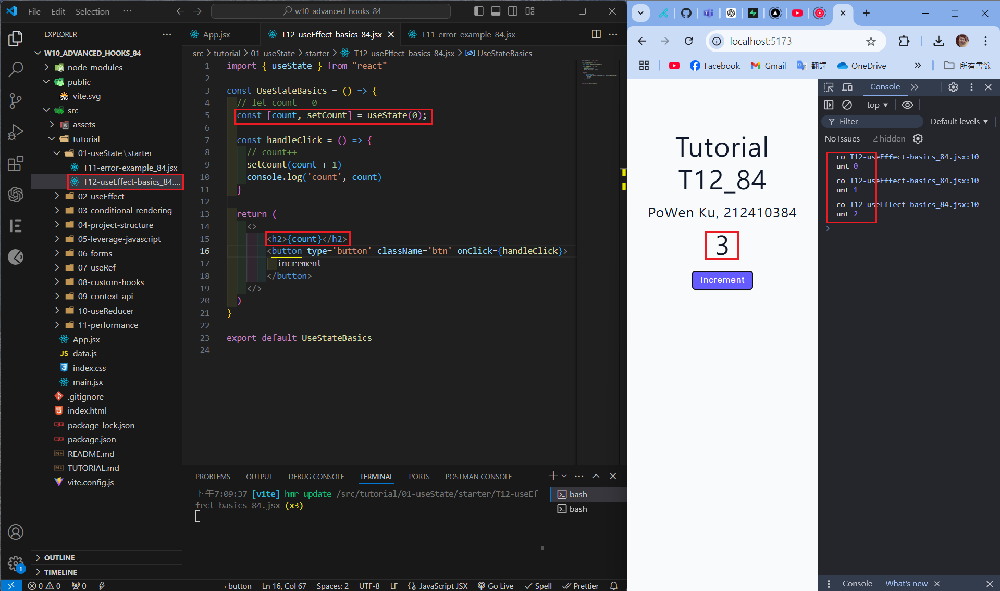
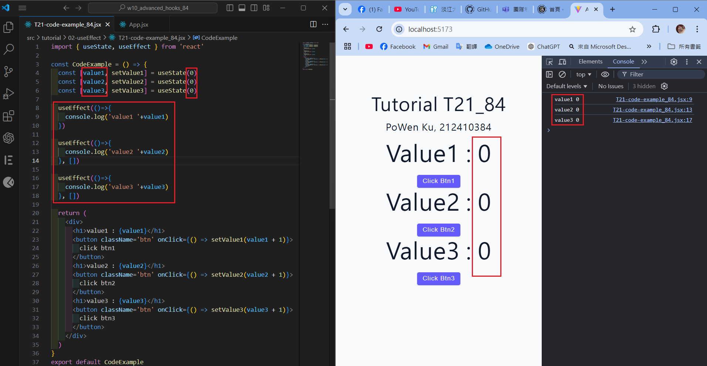
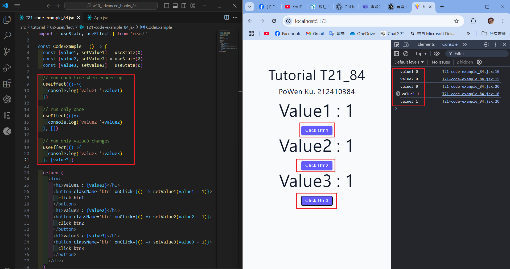
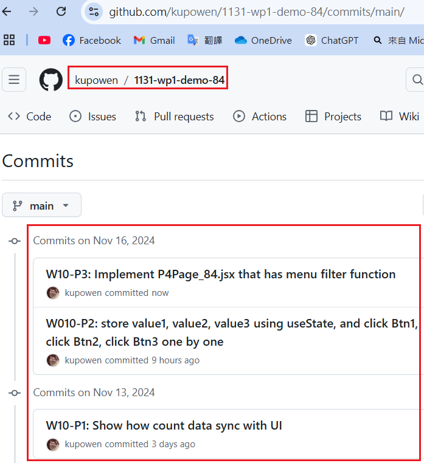

[Githun URL](https://github.com/kupowen/1131-wp1-demo-84)

### W10-P1: Show how count data sync with UI

#### => data not sync with UI


#### => data sync  with UI


```
c9f313f 212410384       Wed Nov 13 19:15:33 2024 +0800         W10-P1: Show how count data sync with UI  
```

### W010-P2: store value1, value2, value3 using useState, and click Btn1, click Btn2, click Btn3 one by one

#### => first time



#### => click Btn1, click Btn2, click Btn3 one by one



```

```

### W10-P3: 

#### => from local


#### => from Vercel


```

```

### W10-P4: 



```

```

### W10-P5: all git logs of w10


```
git log --pretty=format:"%h%x09%an%x09%ad%x09%s" --after="2024-11-12"

```