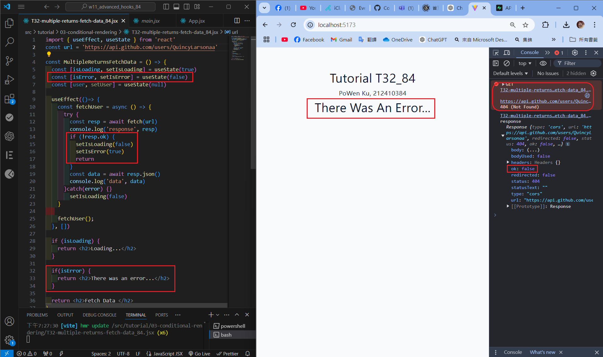
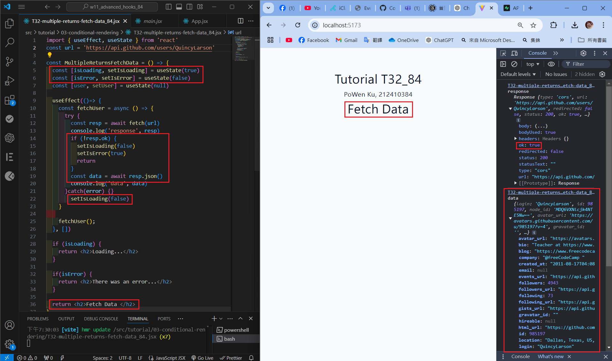
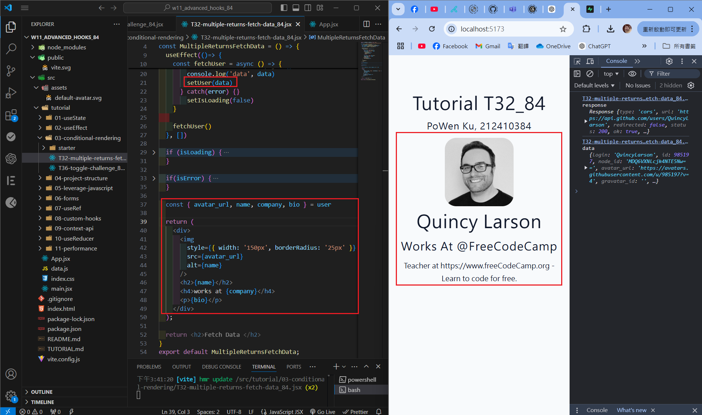
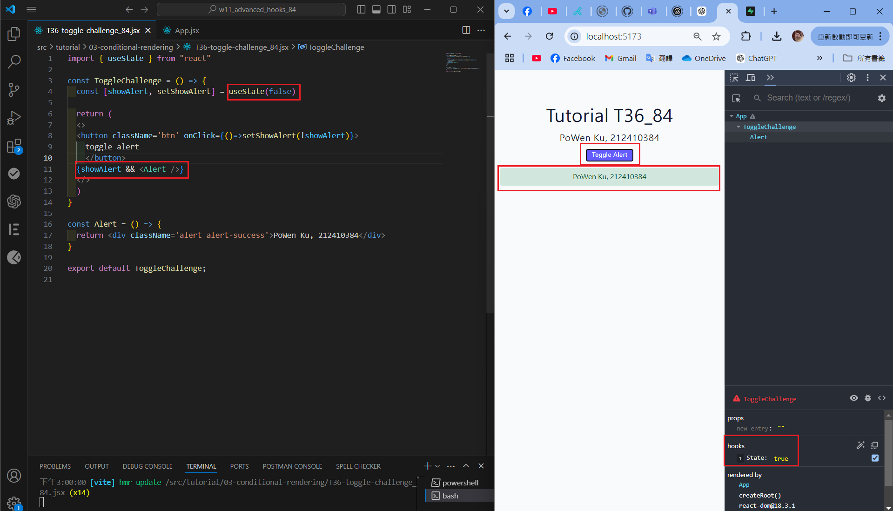
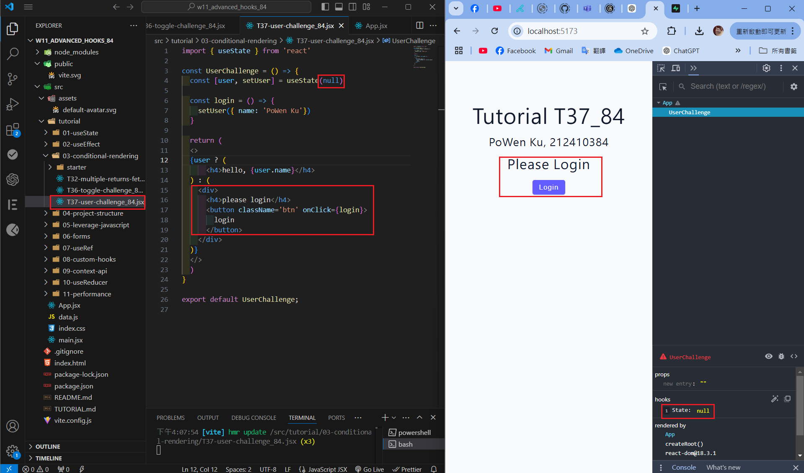
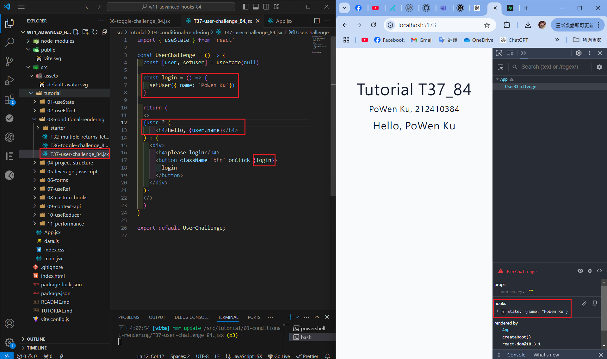
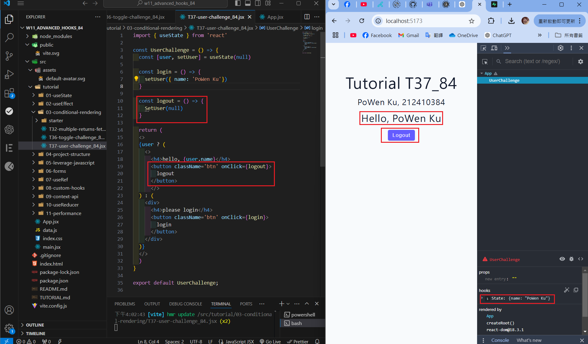
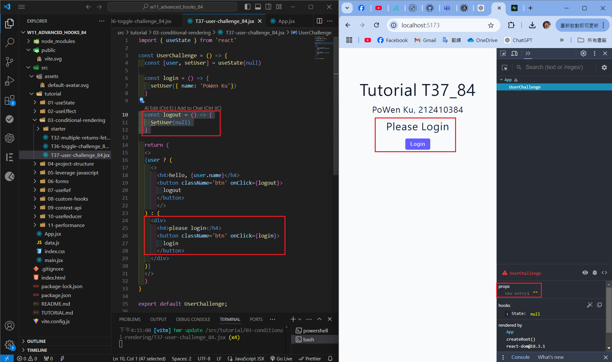
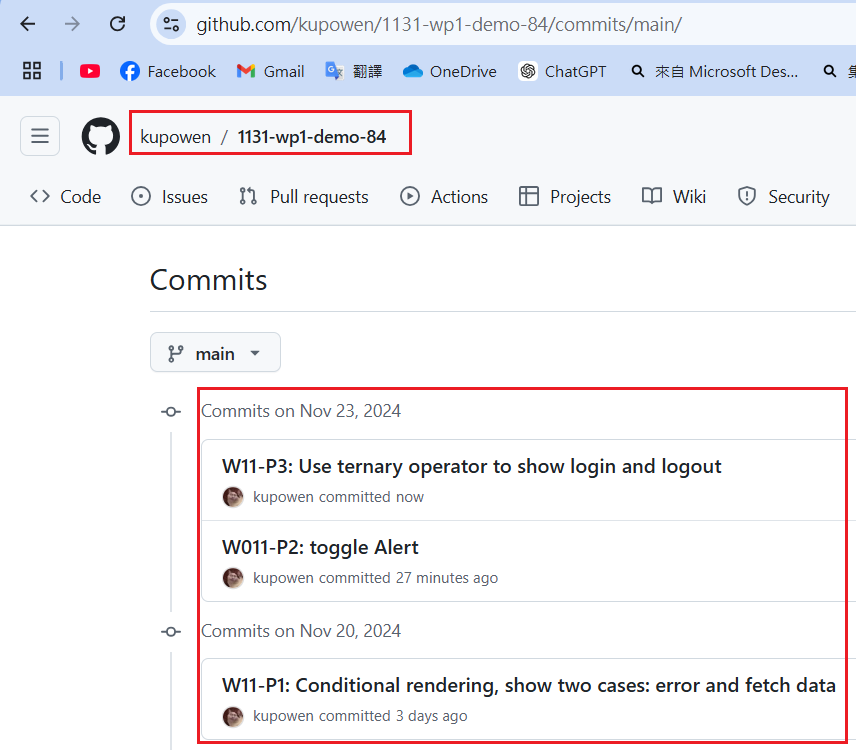

[Githun URL](https://github.com/kupowen/1131-wp1-demo-84)

### W11-P1: Conditional rendering, show two cases: error and fetch data

#### => show "error" message



#### => show "fetch data" message



#### => show "Quincy Larson" message?



```
0ddbe34 212410384       Wed Nov 20 19:35:29 2024 +0800  W11-P1: Conditional rendering, show two cases: error and fetch data
```

### W11-P2: toggle Alert



```
bc29905 212410384       Sat Nov 23 15:49:37 2024 +0800  W011-P2: toggle Alert
```

### W11-P3: Use ternary operator to show login and logout

#### => initially, no user



#### => press login button



#### => add logout functionality



#### => press logout button




```

```

### W11-P4: all git logs of w11



```
git log --pretty=format:"%h%x09%an%x09%ad%x09%s" --after="2024-11-19"

```