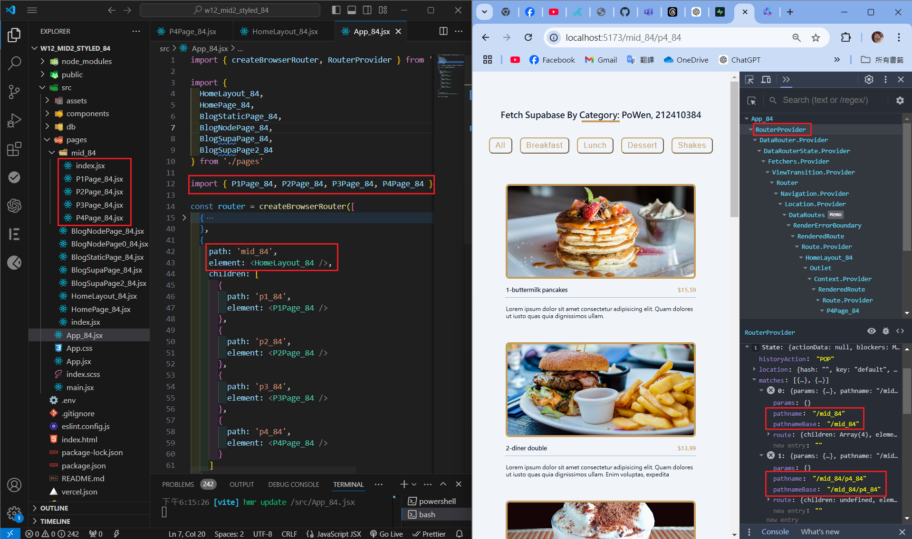
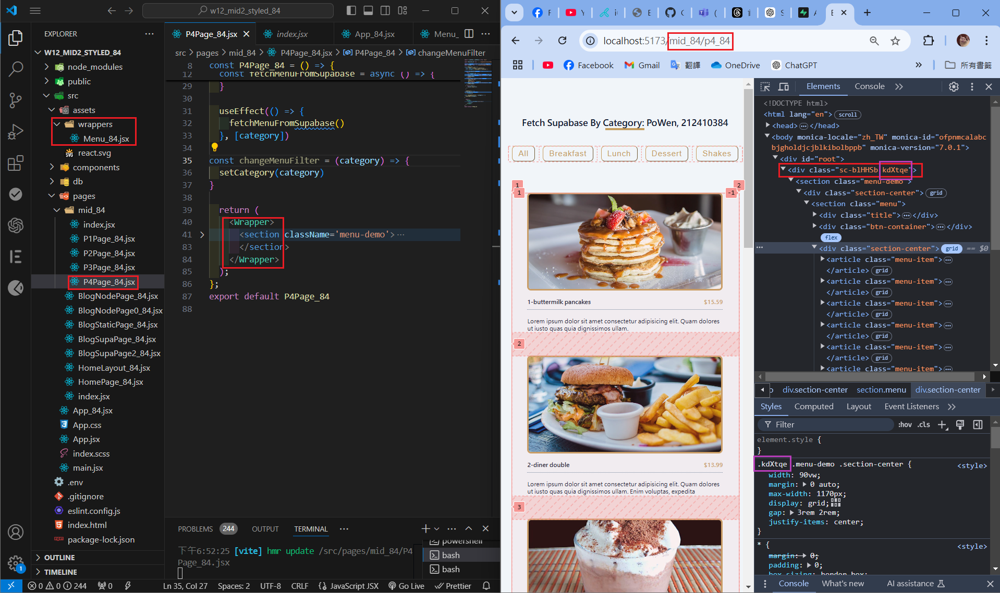
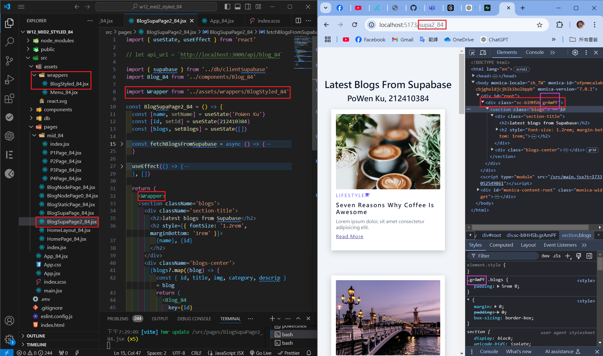
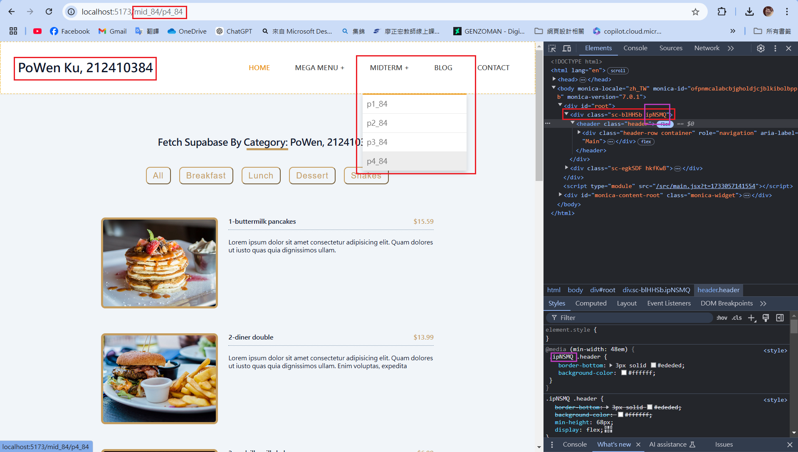
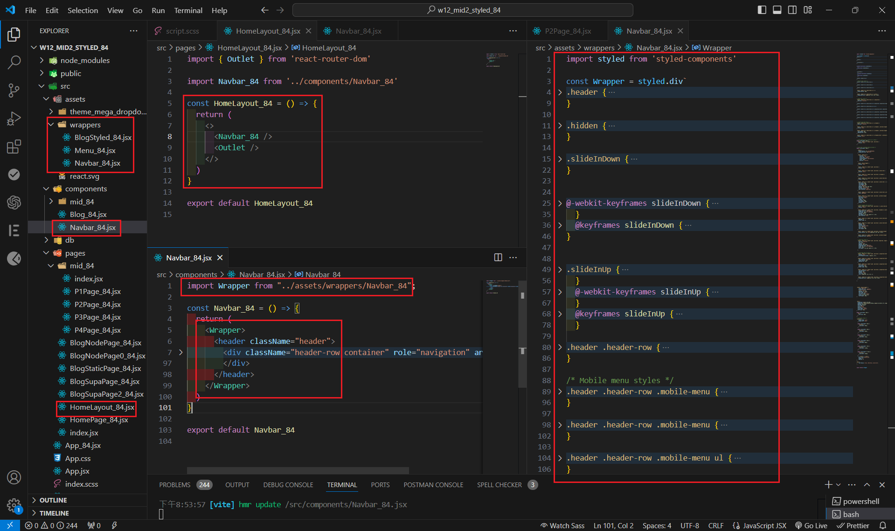
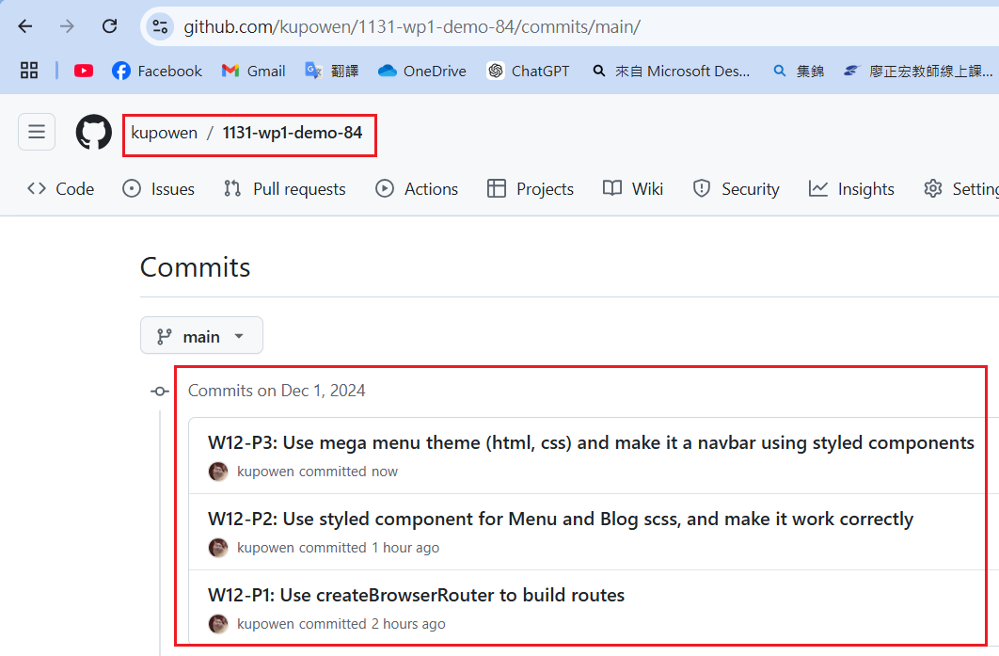

[Githun URL](https://github.com/kupowen/1131-wp1-demo-84)

### W12-P1: Use createBrowserRouter to build routes



```
af30a7e 212410384       Sun Dec 1 18:27:25 2024 +0800   W12-P1: Use createBrowserRouter to build routes
```

### W12-P2: Use styled component for Menu and Blog scss, and make it work correctly

#### => Show Menu with route /mid_84/p4_84



#### => Show the code using Menu styled component


#### => Show Blog with route /supa2_84



```

```

### W12-P3: 

#### => 



#### => 



#### => 


#### => 


```

```

### W12-P4: all git logs of w12



```
git log --pretty=format:"%h%x09%an%x09%ad%x09%s" --after="2024-11-26"

```