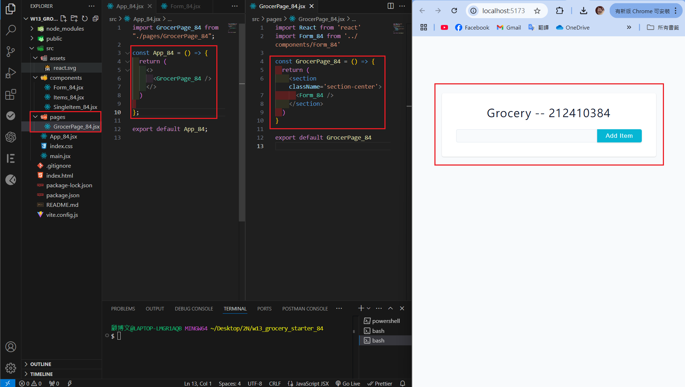
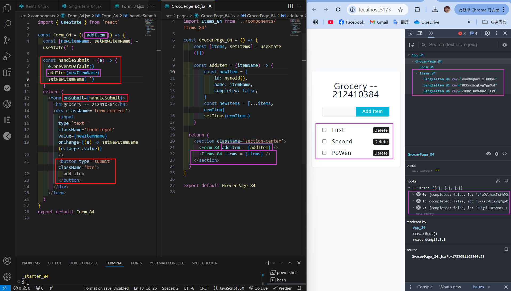
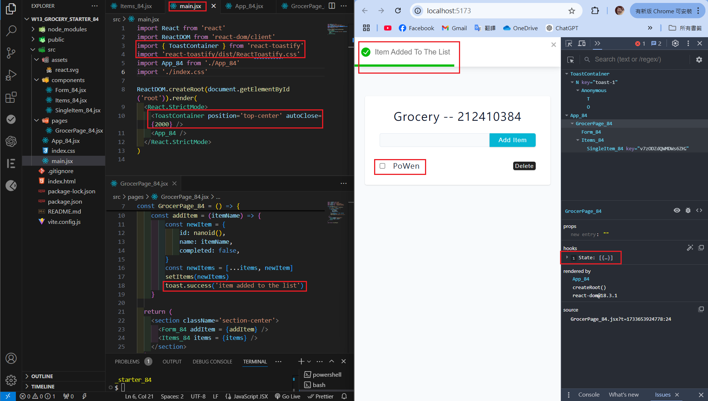
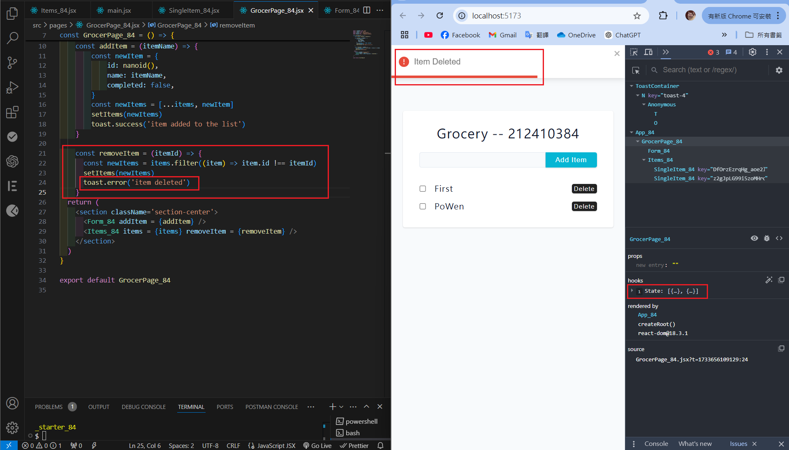
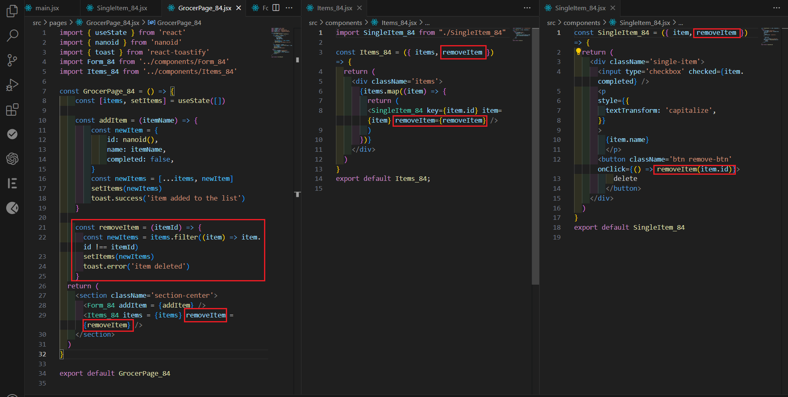
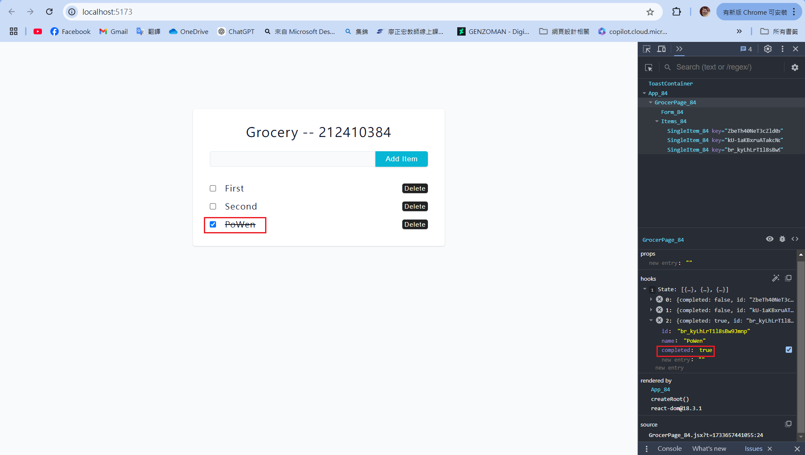
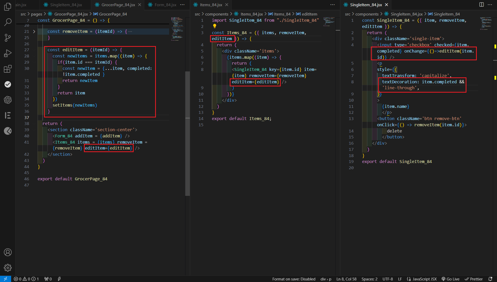
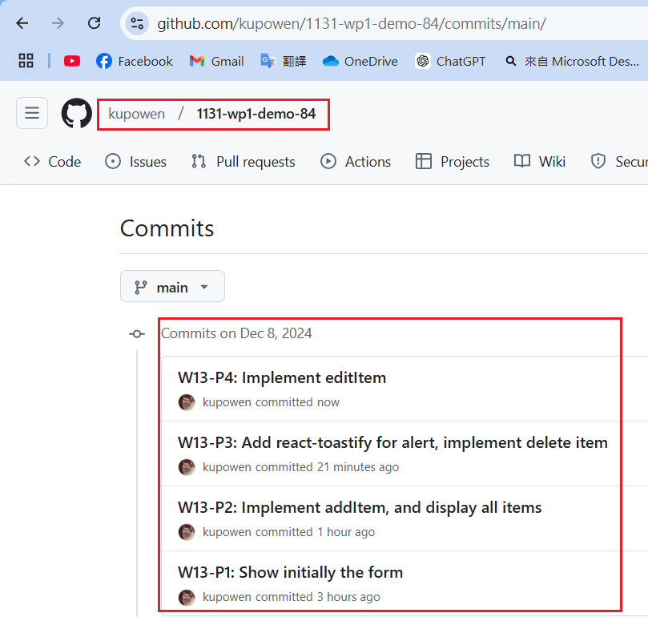

[Githun URL](https://github.com/kupowen/1131-wp1-demo-84)

### W13-P1: Show initially the form



```
2fc3611 212410384       Sun Dec 8 16:15:38 2024 +0800   W13-P1: Show initially the form
```

### W13-P2: Implement addItem, and display all items

#### => Form_84.jsx, Grocery_84.jsx code



#### => Items_84.jsx, SingleItem_84.jsx code


```
42f8521 212410384       Sun Dec 8 18:24:24 2024 +0800   W13-P2: Implement addItem, and display all items
```

### W13-P3: Add react-toastify for alert, implement delete item

#### => Show how to make react-toastify work



#### => Add three items, and remove the second one



#### => Show how removeItem() being transferred from GroceryPage_84 -> Items_84 -> SingleItem_84



```
ee8aa98 212410384       Sun Dec 8 19:19:04 2024 +0800   W13-P3: Add react-toastify for alert, implement delete item
```

### W13-P4: Implement editItem

#### => Add three items, and edit the third item by pressing checkbox



#### => Show how editItem() being transferred from GroceryPage_84 -> Items_84 -> SingleItem_84



```


```

### W13-P5: all git logs of w13



```
git log --pretty=format:"%h%x09%an%x09%ad%x09%s" --after="2024-12-04"

```