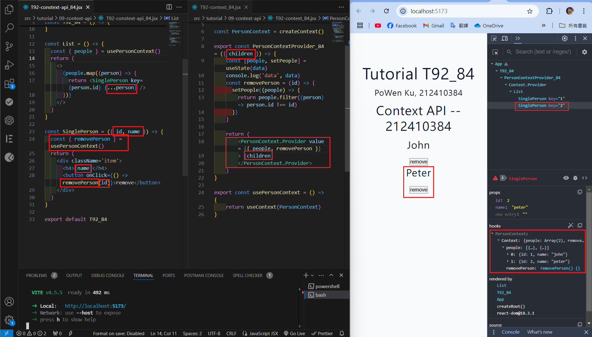
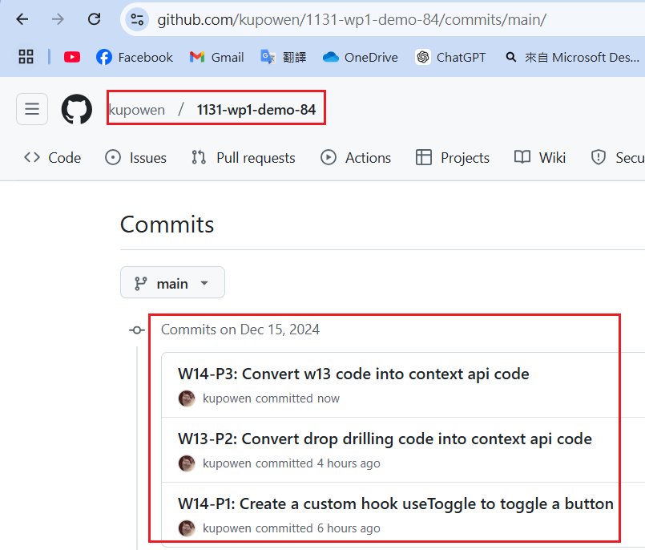

[Githun URL](https://github.com/kupowen/1131-wp1-demo-84)

### W14-P1: Create a  custom hook useToggle to toggle a button


```
eb9a3c4 212410384       Sun Dec 15 17:21:30 2024 +0800  W14-P1: Create a  custom hook useToggle to toggle a button
```

### W13-P2: Convert drop drilling code into context api code



```
208b51f 212410384       Sun Dec 15 18:38:47 2024 +0800  W13-P2: Convert drop drilling code into context api code
```

### W14-P3: Convert w13 code into context api code

#### => Show from chrome components and SingleItem_84


#### => Show code (main.jsx, App_84.jsx, Form_84.jsx)


#### => Show code (Items_84.jsx, SingleItems_84.jsx)


```

```

### W14-P4: all git logs of w14



```
git log --pretty=format:"%h%x09%an%x09%ad%x09%s" --after="2024-12-10"

```