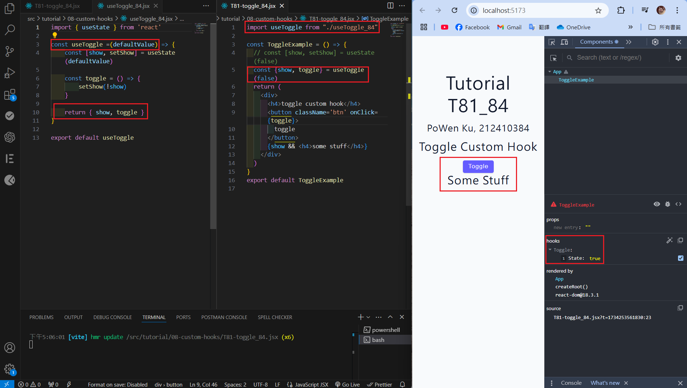
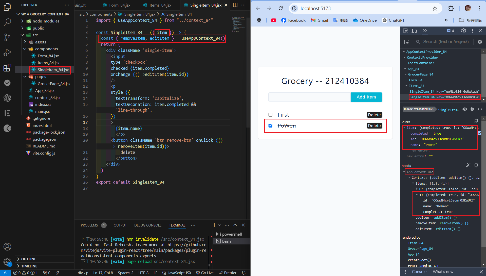
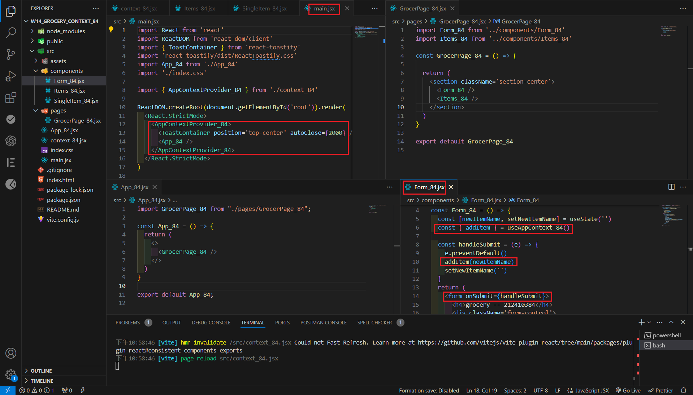
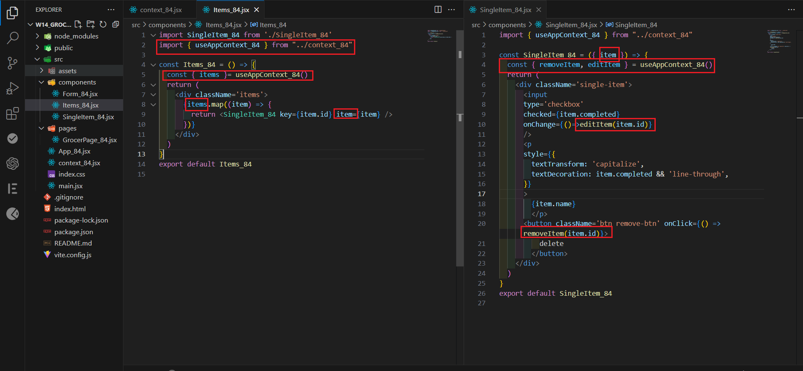

[Githun URL](https://github.com/kupowen/1131-wp1-demo-84)

### W14-P1: Create a  custom hook useToggle to toggle a button



```

```

### W13-P2: 

#### => 


#### => 


```

```

### W14-P3: 

#### => 



#### => 



#### => 



```

```

### W14-P4: 

#### => 


#### => 


```

```

### W14-P5: all git logs of w14


```
git log --pretty=format:"%h%x09%an%x09%ad%x09%s" --after="2024-12-10"

```